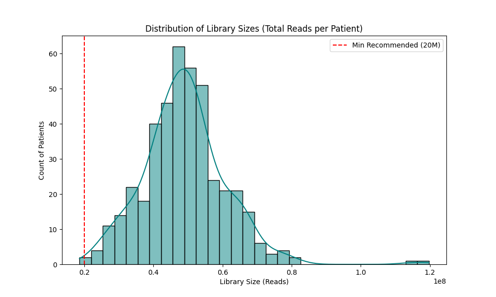
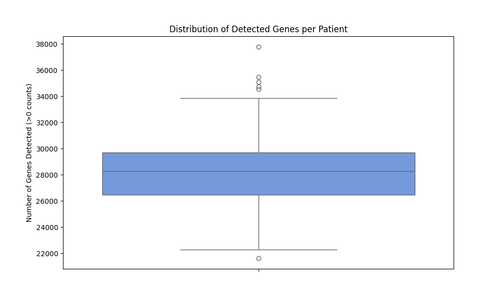

# Transcriptome Health Dashboard

A professional Bioinformatics QC pipeline for assessing RNA-Seq data quality. This tool profiles library sizes, detects gene counts, and generates visual dashboards to identify failed samples.

## Project Overview
* **Dataset:** TCGA-LIHC (Liver Hepatocellular Carcinoma)
* **Scale:** 60,660 Genes x 425 Patients
* **Goal:** Diagnose sequencing depth and library complexity before downstream AI analysis.

## Key Results (Generated Dashboards)

### 1. Library Size Distribution
*This histogram proves that all patients exceed the minimum threshold of 20 Million reads (Red Line). The "Bell Curve" shape indicates consistent sequencing depth across the cohort.*



---

### 2. Gene Detection Complexity
*This boxplot shows the range of detected genes per patient. No samples show extreme dropout, confirming high-quality libraries.*



## Tech Stack
* **Python 3.9+**
* **Pandas** (Big Data Wrangling)
* **Seaborn** (Publication-Ready Visualization)
* **Matplotlib** (Statistical Plotting)

## Usage

```bash
# 1. Load Data & Calculate Metrics
python -m src.qc

# 2. Generate Dashboard Plots
python -m src.visualize