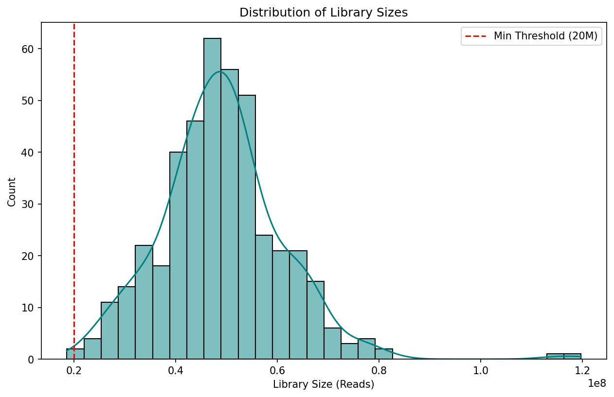
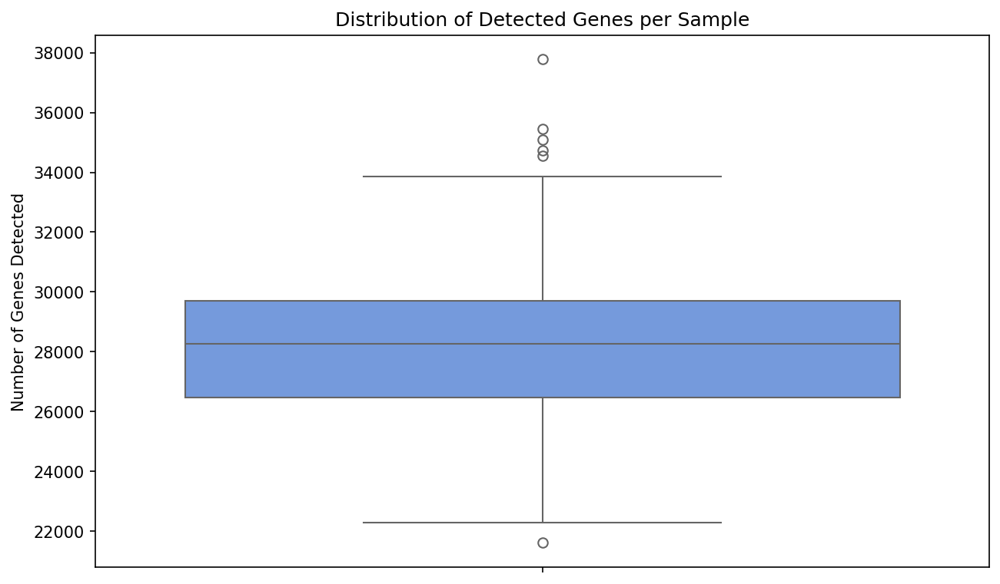

# Transcriptome Health Dashboard v2.0

A professional-grade RNA-Seq quality control and analysis pipeline implementing biologically-rigorous normalization, interactive visualizations, and comprehensive sample QC metrics.


---

## Overview

This pipeline performs comprehensive quality control analysis for bulk RNA-Seq datasets, implementing industry-standard bioinformatics practices:

| Feature | Description |
|---------|-------------|
| **CPM Normalization** | Counts Per Million normalization for cross-sample comparability |
| **Gene Filtering** | Removal of lowly-expressed genes for noise reduction |
| **PCA Analysis** | Sample structure visualization and batch effect detection |
| **Mitochondrial QC** | Detection of degraded samples via MT-gene content |
| **Outlier Detection** | Automated flagging of samples failing QC thresholds |
| **Interactive Dashboards** | Vibrant Plotly HTML reports with gradient colorscales |

### Dataset Characteristics

- **Source:** TCGA-LIHC (The Cancer Genome Atlas - Liver Hepatocellular Carcinoma)
- **Dimensions:** 60,660 genes x 424 samples
- **Purpose:** Assessment of sequencing depth and library complexity prior to downstream analysis

---

## Results

### Interactive Dashboard

The pipeline generates a comprehensive interactive HTML dashboard with vibrant gradient colorscales for enhanced data visualization. Open `results/dashboard.html` in your browser to explore:

| Visualization | Colorscale | Purpose |
|--------------|------------|----------|
| Library Size Histogram | **Viridis** (blue-green-yellow) | Sequencing depth distribution |
| Gene Detection Scatter | **Plasma** (magenta-orange-yellow) | Library complexity per sample |
| PCA Scatter Plot | **Turbo** (rainbow spectrum) | Sample clustering with colorbar |
| MT Content Bar Chart | **RdYlGn_r** (green-to-red) | Sample quality indicator |

All plots feature hover tooltips, zoom controls, and publication-ready aesthetics.

### 1. Library Size Distribution

The distribution of sequencing depth across the cohort demonstrates that 423 of 424 samples (99.8%) exceed the minimum threshold of 20 million reads. The approximately normal distribution indicates consistent sequencing depth across the cohort, with a mean of 49.0M reads and median of 48.7M reads.



*Figure 1. Distribution of library sizes (total mapped reads) across 424 TCGA-LIHC samples. Viridis colorscale indicates read depth gradient. The dashed red line indicates the minimum threshold of 20M reads.*

### 2. Gene Detection Complexity

Gene detection complexity serves as an indicator of library diversity. Samples exhibiting low gene detection may indicate RNA degradation, library preparation artifacts, or excessive PCR duplication.



*Figure 2. Distribution of detected genes (count > 0) per sample with Plasma gradient colorscale. Median detection: 28,268 genes. The interquartile range spans 26,483 to 29,702 genes.*

---

## Installation

```bash
# Clone the repository
git clone https://github.com/Qasim-Hussain-Code/Transcriptome-Health-Dashboard.git
cd Transcriptome-Health-Dashboard

# Create virtual environment (recommended)
python -m venv venv
source venv/bin/activate  # On Windows: venv\Scripts\activate

# Install dependencies
pip install -r requirements.txt
```

---

## Usage

### Command Line Interface

```bash
# Basic usage
python -m src.main --input data/TCGA_LIHC_Gene_Expression.csv --output results/

# With custom thresholds
python -m src.main \
  --input data/TCGA_LIHC_Gene_Expression.csv \
  --output results/ \
  --lib-threshold 25000000 \
  --mt-threshold 15
```

### Python API

```python
from src.dataset import RNASeqDataset

# Load and analyze
dataset = RNASeqDataset("data/TCGA_LIHC_Gene_Expression.csv")
dataset.normalize(method="cpm")
dataset.filter_genes(min_cpm=1.0, min_samples_pct=0.5)
dataset.calculate_qc_metrics()
dataset.run_pca(n_components=2)

# Export failed samples
dataset.save_failed_samples("output/failed_samples.csv")

# Generate interactive dashboard
from src.visualize import create_interactive_dashboard
create_interactive_dashboard(dataset, output_dir="output/")
```

---

## Quality Control Metrics

### Library Size (Sequencing Depth)

**Definition:** Total count of mapped reads per sample.

**Threshold:** Minimum 20 million reads recommended for reliable gene expression quantification.

**Interpretation:** Samples below this threshold may exhibit reduced sensitivity for lowly-expressed genes.

### Gene Detection Complexity

**Definition:** Number of genes with at least one mapped read.

**Threshold:** Minimum 15,000 detected genes.

**Interpretation:** Low detection may indicate RNA degradation, over-amplification, or library preparation artifacts.

### Mitochondrial Content

**Definition:** Proportion of reads mapping to mitochondrial genes (MT-prefixed).

**Formula:**

```
MT% = (Sum of MT-gene counts / Total counts) x 100
```

**Threshold:** Maximum 20% recommended.

**Interpretation:** Elevated mitochondrial content suggests cytoplasmic RNA loss due to cell membrane rupture during sample preparation.

**Note:** The TCGA-LIHC dataset uses Ensembl gene identifiers rather than gene symbols, therefore MT-gene detection requires identifier mapping for accurate quantification.

### Principal Component Analysis

**Purpose:** Dimensionality reduction to visualize sample structure and identify potential batch effects or outliers.

**Implementation:** PCA performed on log-transformed, filtered gene expression matrix (13,443 genes after filtering).

**Result:** PC1 (20.8% variance) and PC2 (8.0% variance) together explain 28.8% of total variance.

---

## Scientific Methods

### CPM Normalization

Counts Per Million (CPM) normalization adjusts for differences in sequencing depth:

$$\text{CPM} = \frac{\text{raw counts}}{\text{library size}} \times 10^6$$

**Rationale:** Raw counts are not comparable across samples with different sequencing depths. CPM enables valid cross-sample comparisons.

### Gene Filtering

Low-expression genes contribute noise without biological signal.

**Criterion:** Retain genes with CPM > 1.0 in at least 50% of samples.

**Result:** 13,443 of 60,660 genes (22.2%) passed filtering criteria.

---

## Project Structure

```
Transcriptome-Health-Dashboard/
├── src/
│   ├── dataset.py      # Core RNASeqDataset class
│   ├── main.py         # CLI entry point
│   ├── visualize.py    # Interactive Plotly visualizations
│   ├── qc.py           # Legacy QC functions
│   └── loader.py       # Legacy data loading
├── tests/
│   ├── conftest.py     # Pytest fixtures
│   ├── test_normalization.py
│   ├── test_filtering.py
│   ├── test_qc_metrics.py
│   ├── test_pca.py
│   └── test_loading.py
├── data/
│   └── TCGA_LIHC_Gene_Expression.csv
├── results/
│   ├── dashboard.html
│   ├── qc_metrics.csv
│   ├── failed_samples.csv
│   └── pca_coordinates.csv
├── requirements.txt
├── pyproject.toml
└── README.md
```

---

## CLI Options

| Argument | Default | Description |
|----------|---------|-------------|
| `--input`, `-i` | Required | Path to expression CSV (genes x samples) |
| `--output`, `-o` | Required | Output directory |
| `--lib-threshold` | 20,000,000 | Minimum library size threshold |
| `--mt-threshold` | 20.0 | Maximum mitochondrial percentage |
| `--min-cpm` | 1.0 | CPM threshold for gene filtering |
| `--min-samples-pct` | 0.5 | Fraction of samples for filtering |
| `--skip-pca` | False | Skip PCA analysis |
| `--log-level` | INFO | Logging verbosity |

---

## Testing

```bash
# Run all tests
pytest tests/ -v

# Run with coverage
pytest tests/ --cov=src --cov-report=html

# Run specific test module
pytest tests/test_normalization.py -v
```

All 38 tests pass successfully.

---

## Output Files

| File | Description |
|------|-------------|
| `dashboard.html` | Interactive QC dashboard with all visualizations |
| `qc_metrics.csv` | Per-sample metrics (library size, detected genes, MT%) |
| `failed_samples.csv` | Samples failing QC thresholds with failure reasons |
| `pca_coordinates.csv` | Principal component coordinates per sample |
| `pipeline.log` | Detailed execution log |

---

## Dependencies

| Package | Version | Purpose |
|---------|---------|---------|
| pandas | >=2.0.0 | Data manipulation |
| numpy | >=1.24.0 | Numerical operations |
| scikit-learn | >=1.3.0 | PCA, StandardScaler |
| plotly | >=5.18.0 | Interactive visualizations |
| matplotlib | >=3.8.0 | Static plots |
| seaborn | >=0.13.0 | Statistical visualizations |
| pytest | >=7.4.0 | Unit testing |

---

## References

1. Robinson MD, Oshlack A. (2010). A scaling normalization method for differential expression analysis of RNA-seq data. *Genome Biology*, 11(3), R25.

2. Chen Y, Lun AT, Smyth GK. (2016). From reads to genes to pathways: differential expression analysis of RNA-Seq experiments using Rsubread and the edgeR quasi-likelihood pipeline. *F1000Research*, 5, 1438.

3. Luecken MD, Theis FJ. (2019). Current best practices in single-cell RNA-seq analysis: a tutorial. *Molecular Systems Biology*, 15(6), e8746.

---

## License

MIT License - See [LICENSE](LICENSE) for details.

---

## Author

**Qasim Hussain**  
Computational Biology and Bioinformatics
